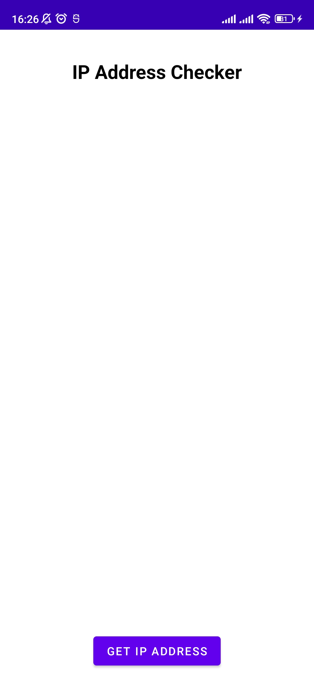
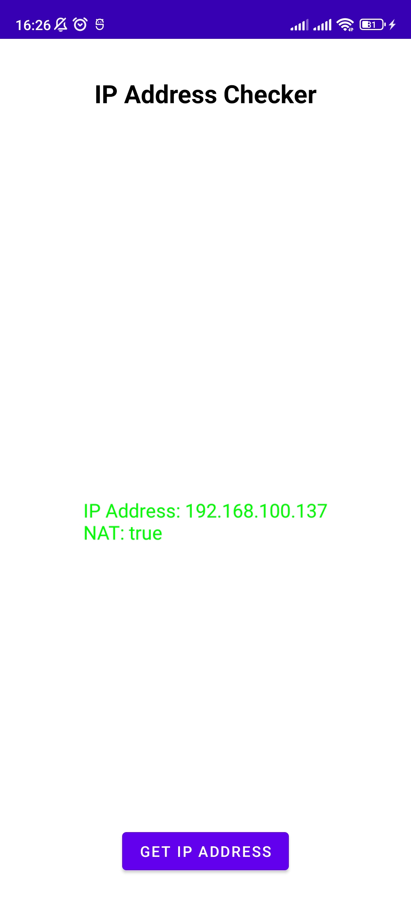

# IP Address Checker

## Overview

IP Address Checker is a simple Android application built using Java and C++ with the Android NDK. This app demonstrates how to retrieve the device's IP address using native code and send it to an HTTP server, displaying the results in a user-friendly interface.

## Features

Native IP Address Retrieval: Utilizes C++ and the NDK's getifaddrs() API to obtain the device's IP address.
IPv6 and IPv4 Support: Prioritizes global unicast IPv6 addresses, public IPv4 addresses, and falls back to any available IPv4 address.
HTTP POST Request: Sends the IP address to a specified server endpoint and handles JSON responses.
User Interface: Clean and responsive UI using ConstraintLayout, with progress indicators and results display.

## Usage

Launch the App: The main screen provides a button to initiate the IP address retrieval process.
Get IP Address: Press the "Get IP Address" button to fetch the device's IP address.
Send to Server: The app sends the IP address to the server and displays the server's response, indicating whether the address is behind a NAT.

## Requirements

Android API Level 24+
Latest NDK LTS Release

## Screenshots

